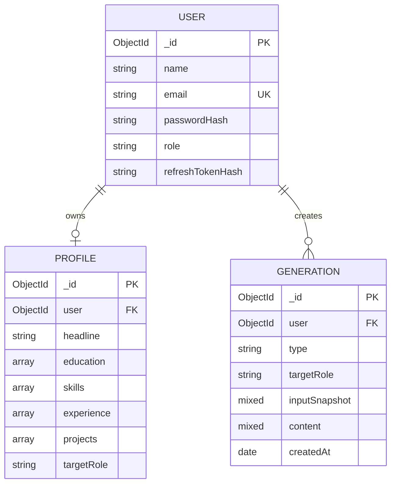

# CareerCoach ER Diagram

```mermaid
erDiagram
    USER ||--o| PROFILE : owns
    USER ||--o{ GENERATION : creates

    USER {
      ObjectId _id PK
      string name
      string email UK
      string passwordHash
      string role
      string refreshTokenHash
    }
    PROFILE {
      ObjectId _id PK
      ObjectId user FK
      string headline
      array education
      array skills
      array experience
      array projects
      string targetRole
    }
    GENERATION {
      ObjectId _id PK
      ObjectId user FK
      string type
      string targetRole
      mixed inputSnapshot
      mixed content
      date createdAt
    }
```
